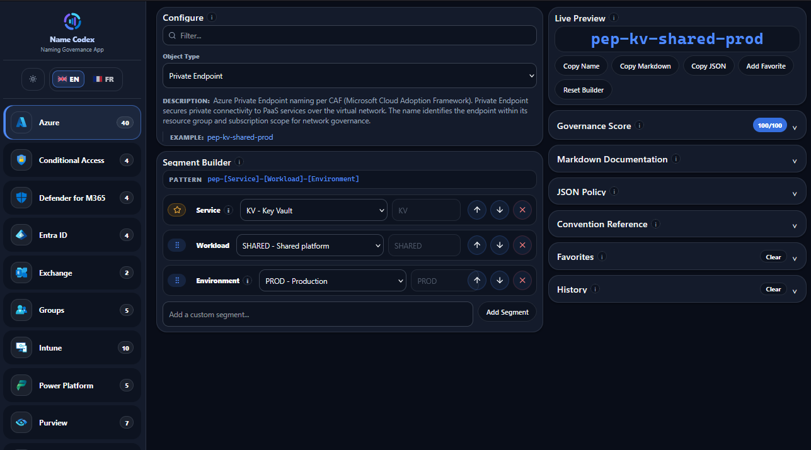

# Name Codex

**Naming Governance App** — Microsoft 365 & Azure naming standards, made visual.

**[View the live demo →](https://name-codex.jeremymaillot.fr/)** — the app is deployed and running at https://name-codex.jeremymaillot.fr/.

Name Codex is a single-page application that helps you define, explore and govern naming conventions for Azure, Microsoft 365, Intune, Defender, Exchange and Groups resources. Pick an object type, assemble its segments, and the app generates, validates and documents the final name in real time.



## Features

### Explore naming standards
- Browse conventions by category: Azure, Entra ID, Exchange, Groups, Intune, Conditional Access, Defender
- Search and filter object types, and switch between their pattern variants
- See the active description and an example for each convention

### Segment builder
- Visually assemble a name from segments (separator-aware)
- Segments can be **fixed** (first/last), **locked**, **recommended**, or free to reorder
- Reorder, remove or add custom segments with one click
- Infobulles (tips) on each segment label to understand what it represents
- **Literals in patterns**: fixed text can be embedded in a pattern (e.g. a `DEF-` prefix or an `ENABLEINEMERGENCY` keyword) and is always regenerated; empty or optional segments are automatically collapsed
- Tooltips on multi-select chips show the description of each selected value
- Live pattern display with a **Modified** badge when you deviate from the convention

### Validation & governance
- Live name preview respecting the convention's validation rules (length, allowed characters, mandatory segments)
- Governance **score /100** with a per-rule checklist
- Policy examples for Conditional Access

### Segment governance
- **Mutual exclusions**: selecting one value disables its opposite (e.g. *Trusted device* vs *Non-trusted device*, *MFA* vs *MFA strength*) so a policy can't be contradictory
- **Conditional values**: the choices offered for a segment can depend on another segment (e.g. endpoint profile types filtered by the chosen OS)
- **Auto-numbered IDs**: fixed-prefix policy IDs with built-in numbering (e.g. `CA001`, `EM001`, `DEVSEC001`) and persona-based ranges for Conditional Access

### Output & persistence
- Copy the generated name or the full Markdown documentation to the clipboard
- Save **favorites** and keep a **history** of copied names (localStorage, persisted between sessions)
- Auto-restores the last object you selected in each category
- **Convention Reference**: a value dictionary for every segment used

### Data-driven
All conventions, segment libraries and generators are plain JSON under `src/rules`, `src/data/segments`, `src/data/generators` — add or adjust a naming standard without touching the code. Shared segment definitions live in `segment-catalog.json`; individual rules reference libraries and can restrict or reshape them with `allowedValues`, mutual exclusions and pattern literals.

## Tech stack

React + TypeScript + Vite, with all data stored locally as JSON (no backend).

## End-user guide

### 1. Pick a category
Choose a category from the sidebar — Azure, Entra ID, Exchange, Groups, Intune, Conditional Access or Defender. The last object you selected in each category is restored automatically on your next visit.

### 2. Select an object type
Use the search box to filter object types, and switch between pattern variants if the object offers several. Each convention shows its active description and an example.

### 3. Assemble your segments
Build the name segment by segment:
- **Fixed segments** (first/last) are pre-placed and cannot move; **locked** segments keep their value; **recommended** segments guide you but stay editable
- Click a segment to pick a value — multi-select chips show a tooltip describing each value
- Reorder, remove or add custom segments in one click
- Hover the tips on each segment label to understand what it represents
- Literals embedded in the pattern (e.g. a `DEF-` prefix or `ENABLEINEMERGENCY`) are regenerated automatically; empty or optional segments collapse on their own

### 4. Respect the governance rules
- Some values are **mutually exclusive**: selecting one disables its opposite (e.g. *Trusted device* vs *Non-trusted device*, *MFA* vs *MFA strength*)
- Offered choices can depend on another segment (e.g. endpoint profile types filtered by the OS you chose)
- Policy IDs are **auto-numbered** (e.g. `CA001`, `EM001`, `DEVSEC001`) with persona-based ranges for Conditional Access

### 5. Validate and check your score
Watch the live preview respect the convention's validation rules (length, allowed characters, mandatory segments). A **Modified** badge appears when you deviate from the convention. Track your **governance score /100** with its per-rule checklist.

### 6. Save or share
- Copy the generated name or the full **Markdown documentation** to the clipboard
- Star it as a **favorite** or keep it in your **history** (both persist locally between sessions)
- Refer to the **Convention Reference** for a value dictionary of every segment used

## Build it yourself

### 1. Install Node.js

Download and install the latest **LTS** version from <https://nodejs.org/>.

Verify the installation from a terminal:

```bash
node -v
npm -v
```

Both commands should print a version number.

### 2. Clone the repository

```bash
git clone https://github.com/jmaillot/name-codex.git
cd name-codex
```

### 3. Install dependencies

```bash
npm install
```

### 4. Run the development server

```bash
npm run dev
```

Open the local URL printed in the terminal (usually <http://localhost:5173/>) in your browser.

### Available scripts

| Script                  | Description                                      |
| ----------------------- | ------------------------------------------------ |
| `npm run dev`           | Start the development server (HMR)               |
| `npm run build`         | Type-check and build for production              |
| `npm run lint`          | Run oxlint                                       |
| `npm test`              | Run Vitest unit tests (jsdom, 137 tests)         |
| `npm run test:watch`    | Run tests in watch mode                          |
| `npm run test:coverage` | Run tests with v8 coverage (80% lines on src/lib) |
| `npm run preview`       | Preview the production build locally             |

The production build is output to `dist/` and can be served by any static file server.